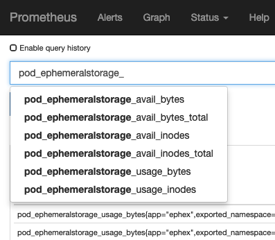

# ephex - Ephemeral statistics exporter
*WIP - Work in progress*

[](https://travis-ci.org/elabit/ephex)

Prometheus exporter for Docker ephemeral storage statistics 

## What it does

This exporter provides metrics about the usage of ephemeral storage on each node in the Kubernetes cluster. Under certain circumstances, ephemeral storage cannot be cleaned up, which leads to unexpected results.



## Deployment 

The `manifests` folder contains all files to deploy ephex into a Kubernetes/Openshift cluster. 

Before deploying, plese replace the Helm variables `{{ .Values.namespace }}` by the namespace ephex should be running in. 

Then: 
```
cd manifests
oc apply -f *.yaml
```

## Get it 

Images are available on [Docker Hub](https://cloud.docker.com/u/elabit/repository/docker/elabit/ephex)

## Questions & Issues 

Feel free to test this exporter and to create pull requests.

## TODO

* Cleanup Docker image
  * Remove development packages
  * change to python image
* write documentation
* treeder/bump VERSION
* ClusterRole needs adaption
